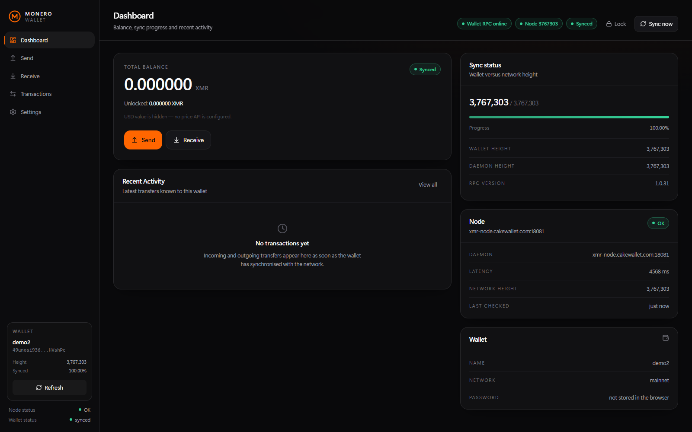

<div align="center">

# Monero Web Wallet

**A self-hosted Monero web wallet with a premium dark UI — powered by the official `monero-wallet-rpc`, with no third-party servers, no telemetry and no mock data.**

[](https://github.com/AMLChecker/monero-web-wallet/actions/workflows/build.yml)
[](LICENSE)
[](https://github.com/AMLChecker/monero-web-wallet)
[](https://nodejs.org)
[](https://www.getmonero.org/downloads/)
[](CONTRIBUTING.md)

[Features](#features) · [Screenshots](#screenshots) · [Quick start](#quick-start-windows) · [Configuration](#configuration) · [Security](SECURITY.md) · [FAQ](#faq) · [Donate](#support-the-project)

<a href="docs/screenshots/hero.png"></a>

<sub><i>Dashboard of a freshly created demo wallet (no funds): total and unlocked balance, wallet vs. network height, node status and recent activity. Click to open full size.</i></sub>

</div>

---

**Monero Web Wallet** is a local web wallet (GUI) for [Monero (XMR)](https://www.getmonero.org/)
that runs entirely on your own computer. The React interface talks only to a small
Node.js backend on `127.0.0.1`, and every wallet operation — creating a wallet, showing
balances, building transactions, relaying them — is executed by the **official
`monero-wallet-rpc` binary**. No Monero cryptography is reimplemented here, no keys
ever leave your machine, and the UI never invents demo balances or fake transactions.

It is made for people who want a modern wallet interface with the privacy model of the
command-line wallet: your keys stay in your own wallet file, your node is your own
choice, and the only thing that touches the network is the Monero daemon.

```
Browser (React UI)  →  Node backend 127.0.0.1:18082  →  monero-wallet-rpc 127.0.0.1:18083  →  monerod / your node
        no keys                  no keys in the browser            official binary             full validation
```

<!-- SEO: monero web wallet, monero-wallet-rpc, self hosted monero wallet, monero gui, monero wallet windows, monero xmr wallet, privacy wallet, react monero wallet -->

## Table of contents

- [What is Monero Web Wallet?](#what-is-monero-web-wallet)
- [Why this wallet?](#why-this-wallet)
- [Features](#features)
- [Screenshots](#screenshots)
- [Architecture](#architecture)
- [Requirements](#requirements)
- [Quick start (Windows)](#quick-start-windows)
- [Manual setup (any OS)](#manual-setup-any-os)
- [Configuration](#configuration)
- [Wallet files and directories](#wallet-files-and-directories)
- [Choosing a node (privacy)](#choosing-a-node-privacy)
- [How sending works](#how-sending-works)
- [Security model](#security-model)
- [HTTP API](#http-api)
- [Project structure](#project-structure)
- [Diagnostics](#diagnostics)
- [Troubleshooting](#troubleshooting)
- [FAQ](#faq)
- [Roadmap](#roadmap)
- [Support the project](#support-the-project)
- [Contributing](#contributing)
- [License](#license)

## What is Monero Web Wallet?

**Monero Web Wallet is a self-hosted web interface for the official Monero wallet RPC.**
You run it locally, open it in your browser, and manage a real Monero wallet with a
desktop-class dark UI: balance and sync status, transaction history, sending with an
explicit review step, subaddresses with QR codes, node switching and recovery-phrase
backup.

What it is:

- a **local wallet application** (a web UI over `monero-wallet-rpc`), not a hosted service;
- **non-custodial** — your wallet file and keys stay on your disk;
- **transparent** — the source is short and readable: ~1.5k lines of TypeScript in the backend, a small React frontend;
- **honest** — if wallet RPC or your node is down, the UI says so instead of showing fake data.

What it is not:

- not a remote or custodial wallet: there is no server operated by the author;
- not a replacement for the official [Monero GUI](https://www.getmonero.org/downloads/) when you need its advanced tooling;
- not hardware-wallet aware yet (no Ledger/Trezor support);
- not audited — treat it as you would treat any small self-hosted wallet project (see [SECURITY.md](SECURITY.md)).

## Why this wallet?

| | Monero Web Wallet | Monero GUI | Monero CLI | Hosted web wallets |
| --- | --- | --- | --- | --- |
| Keys stay on your machine | ✅ | ✅ | ✅ | ❌ |
| Works in a browser | ✅ | ❌ | ❌ | ✅ |
| Open source & self-hosted | ✅ | ✅ | ✅ | ❌ |
| Modern responsive UI | ✅ | ⚠️ desktop only | ❌ | ⚠️ |
| Explicit two-phase send (review exact fee, then relay) | ✅ | ❌ | ❌ | ❌ |
| Any Monero wallet file can be opened | ✅ | ✅ | ✅ | ❌ |
| Depends on a third-party server | ❌ (only your node) | ❌ | ❌ | ✅ |

The design goal is simple: **the ergonomics of a modern app, the trust model of the CLI.**

## Features

### Wallet

- Create a new wallet (25-word recovery phrase shown once, with a hide toggle and copy buttons) or open any existing Monero wallet file — you are asked for its password every time.
- Total / unlocked / locked balance, with a sync progress bar comparing wallet height to network height.
- Full transaction history from `get_transfers`: received, sent, pending and failed transfers with confirmations, lock state, payment id, note and a details dialog.
- Subaddresses: create labeled subaddresses, list them, copy any of them, and show a QR code for the selected address.

### Sending

- Recipient address validation through `validate_address` (mainnet only) before anything is built.
- **Two-phase send:** the transaction is built and signed locally with `do_not_relay`, you see the **exact** network fee and the total, and only your explicit confirmation broadcasts it with `relay_tx`.
- Priority selector (low → fastest) and a "MAX" helper that respects locked balances.
- Clear, human-readable errors instead of raw RPC codes ("Not enough spendable balance", "Wallet RPC cannot reach the Monero daemon", …).

### Node

- Live node status: daemon address, height, latency, connection state, wallet-vs-network sync percentage.
- Switch nodes at runtime from Settings (`set_daemon`); the choice is stored in `node-address.txt` for the next launch.
- Works with a local `monerod` or a remote node; the launcher prefers your local node automatically.

### Interface

- Dark, minimal, premium look: background `#09090B`, cards `#111113`, hairline borders, 14–18 px radii, Monero-orange accent, Lucide icons, tabular numerals for amounts.
- Fully responsive: fixed 230 px sidebar on desktop, slide-in drawer on phones and tablets, tables that become card lists on small screens, modals that become bottom sheets.
- Status is always visible: wallet RPC state, node state, sync state, wallet name and address.

### Security

- `monero-wallet-rpc` is bound to `127.0.0.1`, HTTP digest authentication is enabled, and a **fresh random RPC login is generated on every launch**.
- The browser never receives RPC credentials, never talks to the wallet RPC port, and the wallet password is never stored in `localStorage`/`sessionStorage`.
- Passwords, seeds and private keys are never written to logs; prepared transactions live only in backend memory with a short expiry.
- All money math uses atomic units (`BigInt`/strings) — floats are never used for amounts.
- The backend rejects requests with a non-loopback `Host`/`Origin` header (DNS-rebinding and cross-site protection).

## Screenshots

All screenshots below are taken with a freshly created demo wallet that holds no funds — no real address, balance or transaction history is published in this repository.

| Dashboard | Send Monero | Receive / subaddresses |
| --- | --- | --- |
|  |  |  |

| Transactions | Settings (wallet, node, security) | Mobile layout with navigation drawer |
| --- | --- | --- |
|  |  |  |

## Architecture

```
┌──────────┐   HTTP (loopback only)   ┌────────────────┐      JSON-RPC       ┌───────────────────────┐
│ Browser  │ ───────────────────────► │  Node backend  │ ──────────────────► │ monero-wallet-rpc.exe │
│ React UI │ ◄─────────────────────── │ 127.0.0.1:18082│ ◄────────────────── │ 127.0.0.1:18083       │
└──────────┘                          └────────────────┘                     └───────────┬───────────┘
                                                                                         │
                                                                              ┌──────────▼──────────┐
                                                                              │ monerod / remote node│
                                                                              └─────────────────────┘
```

| Layer | Technology | Responsibility |
| --- | --- | --- |
| UI | React 18, Vite, TypeScript, Tailwind CSS, Lucide | Rendering, forms, polling, confirmation dialogs |
| Backend | Node.js, Express, TypeScript | Local-only API, wallet session, two-phase sending, error shaping |
| Wallet RPC client | `node:http` + HTTP digest | Authenticated JSON-RPC to the official binary on a pinned keep-alive socket |
| Wallet engine | `monero-wallet-rpc` (official binary) | All key handling, signing, scanning, relaying |

More detail — including the non-obvious digest-auth behaviour of `monero-wallet-rpc` —
is in [docs/ARCHITECTURE.md](docs/ARCHITECTURE.md).

## Requirements

- **Windows 10/11** for the `Start.bat` launcher. The backend and frontend themselves are
  cross-platform, so macOS/Linux users can run them manually (see
  [Manual setup](#manual-setup-any-os)).
- **Node.js 18+**.
- **Official Monero CLI binaries** in the project folder:
  `monero-wallet-rpc.exe`, `monero-wallet-cli.exe`, `monerod.exe` — download from
  <https://www.getmonero.org/downloads/> or
  <https://github.com/monero-project/monero/releases>.
  They are **not** part of this repository.
- A reachable Monero daemon: your own `monerod` (recommended) or a remote node.

## Quick start (Windows)

```text
1. Put monero-wallet-rpc.exe, monero-wallet-cli.exe and monerod.exe next to Start.bat
2. Double-click Start.bat
3. Your browser opens http://127.0.0.1:18082/#/welcome
4. Click "Open main" (or "Create New Wallet") and enter your wallet password
```

What the launcher does:

1. checks for `monero-wallet-rpc.exe` and Node.js;
2. installs npm dependencies in `backend` and `frontend` when they are missing;
3. builds the backend and the UI when their `dist` folders are missing;
4. starts `monero-wallet-rpc.exe` on `127.0.0.1:18083` with a fresh random RPC login;
5. starts the backend on `127.0.0.1:18082` (it also serves the built UI);
6. opens the wallet in your default browser.

```text
[Check] monero-wallet-rpc.exe found
[Check] Node.js v22.14.0 found
[Monero] Starting Wallet RPC...
[Backend] Starting...
[Frontend] Starting...
[Wallet] Ready
```

Services keep running in the background without extra windows; logs go to
`logs\backend.log` and `logs\wallet-rpc.log`, PID files to `.run\`.

**Commands**

```bat
Start.bat              start everything (builds if needed)
Start.bat --rebuild    force a rebuild of backend and frontend
Start.bat --dev        run the Vite dev server on 127.0.0.1:5173 (hot reload)
Stop.bat               stop all services (by PID file and by port)
```

## Manual setup (any OS)

```bash
# 1. official wallet RPC (replace the path with your Monero binaries)
monero-wallet-rpc --wallet-dir . --rpc-bind-ip 127.0.0.1 --rpc-bind-port 18083 \
  --rpc-login user:pass --daemon-address 127.0.0.1:18081 --non-interactive

# 2. backend
cd backend
npm install
npm run build
MONERO_RPC_LOGIN=user:pass npm start        # Windows: set MONERO_RPC_LOGIN=user:pass

# 3. frontend (development, proxies /api to the backend)
cd ../frontend
npm install
npm run dev                                 # http://127.0.0.1:5173
npm run build                               # production bundle in frontend/dist
```

When `frontend/dist` exists, the backend serves it, so a "production" run is just
`npm run build` in both packages and `node backend/dist/server.js`.

## Configuration

All environment variables are optional.

| Variable | Default | Description |
| --- | --- | --- |
| `MONERO_RPC_URL` | `http://127.0.0.1:18083/json_rpc` | Wallet RPC endpoint |
| `MONERO_RPC_LOGIN` | value of `.rpc-credentials` | `user:password` for digest authentication |
| `MONERO_WALLET_DIR` | project root, or `wallets/` when it already contains wallets | Directory passed to `--wallet-dir` |
| `MONERO_DAEMON_ADDRESS` | `127.0.0.1:18081`, then `node-address.txt` | Monero daemon (`host:port` or `http(s)://host:port`) |
| `MONERO_SEND_MODE` | `prepare` | `prepare` = build → confirm → relay; `direct` = one confirmed `transfer` |
| `PORT` / `HOST` | `18082` / `127.0.0.1` | Backend bind address (keep it loopback) |
| `LOG_LEVEL` | `info` | `debug`, `info`, `warn`, `error` |
| `MONERO_BACKEND_PORT` | `18082` | Backend port used by the Vite dev proxy |
| `MONERO_FRONTEND_PORT` | `5173` | Vite dev server port |

### Ports

| Service | Address |
| --- | --- |
| Wallet UI + backend API | `127.0.0.1:18082` |
| `monero-wallet-rpc` | `127.0.0.1:18083` |
| Vite dev server (`Start.bat --dev`) | `127.0.0.1:5173` |

## Wallet files and directories

`monero-wallet-rpc` is started with a fixed `--wallet-dir`; the launcher resolves it as:
`MONERO_WALLET_DIR` → `wallets/` (when it already contains `*.keys`) → the project root.

A Monero wallet is always a pair of files: `<name>` and `<name>.keys`. They are
git-ignored and this project never moves, copies or deletes them. Any wallet created by
the official CLI or GUI can be opened; the UI asks for its password.

## Choosing a node (privacy)

Resolution order: `MONERO_DAEMON_ADDRESS` → a locally running `monerod` on
`127.0.0.1:18081` → `node-address.txt` → the fallback node defined in `Start.bat`
(`FALLBACK_NODE`). You can switch at any time in **Settings → Change daemon**.

Running your own `monerod` is strongly recommended: it validates the chain yourself and
no third party sees your IP address or which blocks your wallet asks for. A remote node
will still work (and the UI warns you when one is used), but it can observe your wallet's
network activity.

## How sending works

```text
Review transaction                     Confirm & Send
        │                                     │
        ▼                                     ▼
transfer(do_not_relay: true)  ─────►  relay_tx(tx_metadata)  ─────►  Monero network
   builds & signs locally                only after your click
   shows the exact fee
```

1. **Review** — the backend builds the transaction locally (`do_not_relay: true`) and
   returns the exact fee, the amount and the total. The signed blob stays on the
   backend; the browser never sees it.
2. **Confirm & Send** — the backend relays it and returns the txid, which then appears
   in the history as pending until it is mined.

Cancelling the dialog discards the prepared transaction — nothing is broadcast, ever,
without that second click. If your wallet RPC build does not return `tx_metadata`, set
`MONERO_SEND_MODE=direct` to sign and broadcast in a single confirmed step.

## Security model

Short version: **loopback only, no credentials in the browser, no secrets in logs, no
float math, no automatic broadcasting.** The full model, threat boundaries and
recommendations are in [SECURITY.md](SECURITY.md).

| Concern | How it is handled |
| --- | --- |
| Wallet RPC exposure | `--rpc-bind-ip 127.0.0.1`, digest auth enabled, never `--disable-rpc-login` |
| RPC credentials | Generated per launch, backend-only (`.rpc-credentials`, git-ignored) |
| Wallet password | Asked per session, never persisted, never logged, never in `localStorage` |
| Recovery phrase | Shown only on creation or explicit export (password re-verified) |
| Prepared transactions | Backend memory only, 10-minute expiry, dropped on cancel |
| Amounts | Atomic units (`BigInt`) everywhere; no floating point |
| Local API access | `Host`/`Origin` must be loopback; `no-store`, `nosniff`, `no-referrer` |
| Accidental sends | Address validated first, explicit confirmation dialog, no auto-send |

## HTTP API

The backend exposes a small JSON API on `127.0.0.1` (no authentication needed because it
is unreachable from other machines — see [SECURITY.md](SECURITY.md)).

| Method | Endpoint | Description |
| --- | --- | --- |
| `GET` | `/api/health` | Backend and wallet RPC liveness |
| `GET` | `/api/wallets` | Wallet files found in the wallet directory |
| `POST` | `/api/wallet/create` | Create a wallet (returns address + recovery phrase) |
| `POST` | `/api/wallet/open` | Open a wallet (password required) |
| `POST` | `/api/wallet/close` | Close the wallet session (`/api/wallet/lock` is an alias) |
| `GET` | `/api/wallet/info` | RPC, wallet, node and sync state |
| `GET` | `/api/wallet/balance` | Total, unlocked and locked balance |
| `GET` | `/api/wallet/address` | Primary address, subaddresses, accounts |
| `GET` | `/api/wallet/transactions` | Normalised `get_transfers` history |
| `POST` | `/api/wallet/send/prepare` | Build a transaction without relaying |
| `POST` | `/api/wallet/send` | Confirm and broadcast a prepared transaction |
| `POST` | `/api/wallet/send/cancel` | Discard a prepared transaction |
| `POST` | `/api/wallet/subaddress` | Create a labeled subaddress |
| `POST` | `/api/wallet/phrase` | Export the recovery phrase (password re-check) |
| `POST` | `/api/wallet/address/validate` | Validate a Monero address |
| `POST` | `/api/wallet/refresh` | Force a wallet refresh |
| `GET` | `/api/node/status` | Daemon status, height and latency |
| `POST` | `/api/node/daemon` | Switch the daemon at runtime |

Errors are always
`{ "error": { "code": "INSUFFICIENT_FUNDS", "message": "…", "hint": "…" } }` with
human-readable text instead of raw RPC codes.

## Project structure

```
Start.bat / Stop.bat          Windows launcher and shutdown helper
wallets/README.md             wallet directory notes
backend/
  src/server.ts               Express API, static hosting, loopback guards
  src/moneroRpc.ts            JSON-RPC client for monero-wallet-rpc
  src/walletManager.ts        sessions, balances, history, two-phase sending
  src/digestAuth.ts           HTTP digest handshake for the wallet RPC
  src/daemon.ts               daemon probing with stale-while-revalidate cache
  src/amounts.ts              atomic-unit (BigInt) money handling
  src/errors.ts               RPC errors → actionable messages
  src/config.ts               ports, paths, credentials, wallet/node resolution
  src/logger.ts               logging that never records secrets
  scripts/doctor.mjs          standalone RPC diagnostic
frontend/
  src/pages/                  Welcome, CreateWallet, Dashboard, Send, Receive,
                              Transactions, Settings
  src/components/             UI kit, sidebar, transaction list, toasts, logo
  src/state/, src/hooks/      wallet context and polling hooks
  src/api/, src/lib/          typed backend client, XMR formatting, router
docs/ARCHITECTURE.md          implementation notes
docs/screenshots/             UI screenshots (demo wallet, no real funds)
SECURITY.md                   security model and vulnerability reporting
```

## Diagnostics

```bash
cd backend
node scripts/doctor.mjs
```

It prints the configured endpoint, whether credentials are present, a raw handshake
probe and a couple of RPC calls — the fastest way to distinguish "wallet RPC is not
running" from "credentials are wrong".

## Troubleshooting

| Symptom | Cause / fix |
| --- | --- |
| **Wallet RPC Offline** | `monero-wallet-rpc.exe` is not running or port 18083 is busy. Run `Stop.bat`, then `Start.bat`; check `logs\wallet-rpc.log`. |
| **This wallet is already open in another Monero program** | The wallet file is locked by `monero-wallet-cli.exe` or another wallet window. Close it and retry. |
| **Daemon unavailable** | The node is unreachable — start `monerod` or set another node in Settings. |
| **monero-wallet-rpc cannot see this wallet file** | The RPC process was started with a different `--wallet-dir`. Start everything with `Start.bat`, or align `MONERO_WALLET_DIR`. |
| **Port 18082/18083 already in use** | An older instance is still running: `Stop.bat` or end the process in Task Manager. |
| UI shows old heights | Click **Sync now**; a remote node can be slow (latency is shown in Settings). |
| `npm install` warns about blocked install scripts (`esbuild`) | npm 11+ policy. The Vite build still works; otherwise run `npm install-scripts approve esbuild` inside `frontend`. |
| Address rejected when sending | The address must be a mainnet Monero address (or subaddress). Integrated addresses and testnet are not supported by the form. |

## FAQ

<details>
<summary><b>Is this a custodial or hosted wallet?</b></summary>

No. Nothing is hosted: you run the software on your own computer. There is no service
operated by the author that could see your keys, and the backend refuses connections
that do not come from your own machine.
</details>

<details>
<summary><b>Where are my private keys and seed stored?</b></summary>

Only in your own Monero wallet file (`<name>` + `<name>.keys`), exactly as with the
official CLI or GUI. The web UI never stores keys; the recovery phrase is displayed for
backup and is not persisted anywhere.
</details>

<details>
<summary><b>Do I need a full Monero node?</b></summary>

No — any reachable `monerod` or remote node works. Your own node is recommended for
privacy and reliability.
</details>

<details>
<summary><b>Does it work on Linux or macOS?</b></summary>

Yes, with the manual setup: run your platform's `monero-wallet-rpc`, the Node backend and
the Vite/`dist` frontend. Only `Start.bat`/`Stop.bat` are Windows-specific.
</details>

<details>
<summary><b>Can it open my existing wallet created by the Monero CLI or GUI?</b></summary>

Yes. Put the wallet files in the wallet directory (or set `MONERO_WALLET_DIR`), restart,
and open the wallet from the welcome screen with its password.
</details>

<details>
<summary><b>Is the wallet password stored anywhere?</b></summary>

It is used only to open the wallet file and is never written to disk, logs, cookies or
`localStorage`. If you export the recovery phrase, you are asked for it again and the
wallet file is re-opened to verify it.
</details>

<details>
<summary><b>Does it support hardware wallets (Ledger, Trezor)?</b></summary>

Not yet — it drives the software wallet RPC only.
</details>

<details>
<summary><b>Can I send a transaction without reviewing the fee?</b></summary>

There is no way to broadcast a transaction without pressing **Confirm & Send** on the
review dialog that shows the exact fee and total. That is intentional.
</details>

<details>
<summary><b>Why does the UI say "USD value is hidden"?</b></summary>

Because no price API is configured and the project will not invent a rate. Add your own
price source if you want fiat values.
</details>

## Roadmap

Planned, not implemented (contributions welcome):

- optional fiat price display via a user-configured price API;
- address book and labeled contacts;
- integrated addresses and payment IDs in the Receive page;
- multiple accounts (currently account 0 is used);
- translated UI (currently English);
- launcher scripts for Linux and macOS;
- optional hardware-wallet support;
- automated end-to-end tests against a regtest/stagenet daemon.

## Support the project

Monero Web Wallet is developed in spare time, without ads, tracking or paid tiers. If it
is useful to you and you want to support further development (testing time, hardware for
verification, new features), a Monero donation is welcome — entirely optional and
non-refundable.

<div align="center">

<!-- Monero donation address -->


**XMR (mainnet)**

```text
4ApMgwswd6rUeSu3K9bVoyV5hmjcVLuDUePgk4r8bqh85oQYjF3LVTnAiMfp4ukrAL4umhrV6DfaRP5nXbdLZ3CbMTzmico
```

<sub>Scan the QR code with any Monero wallet, or copy the address above.<br>
Send **XMR on mainnet only** — funds sent on another network or asset cannot be recovered.</sub>

</div>

The address in `monero:` URI form:

```text
monero:4ApMgwswd6rUeSu3K9bVoyV5hmjcVLuDUePgk4r8bqh85oQYjF3LVTnAiMfp4ukrAL4umhrV6DfaRP5nXbdLZ3CbMTzmico
```

Other ways to help that cost nothing:

- ⭐ star the repository so more people find it;
- report bugs and rough edges in [Issues](https://github.com/AMLChecker/monero-web-wallet/issues);
- share your setup (local node, OS) in discussions — it directly shapes the roadmap;
- translate the UI or improve the documentation.

## Contributing

Pull requests are welcome — see [CONTRIBUTING.md](CONTRIBUTING.md) for the development
setup and the rules that keep this project trustworthy (no fake data, no secrets in logs,
no float money math, clean TypeScript builds).

## License

[MIT](LICENSE). The Monero binaries referenced by this project are distributed by the
Monero Project under their own license and are not included in this repository.

---

<div align="center">
<sub>

**Keywords:** monero web wallet · monero-wallet-rpc GUI · self-hosted Monero wallet ·
Monero wallet for Windows · XMR wallet UI · non-custodial Monero wallet · Monero privacy
wallet · React Monero wallet · local Monero node wallet · monero-wallet-rpc JSON-RPC

Not affiliated with or endorsed by the Monero Project. Use at your own risk — always keep
an offline backup of your recovery phrase.

</sub>
</div>
