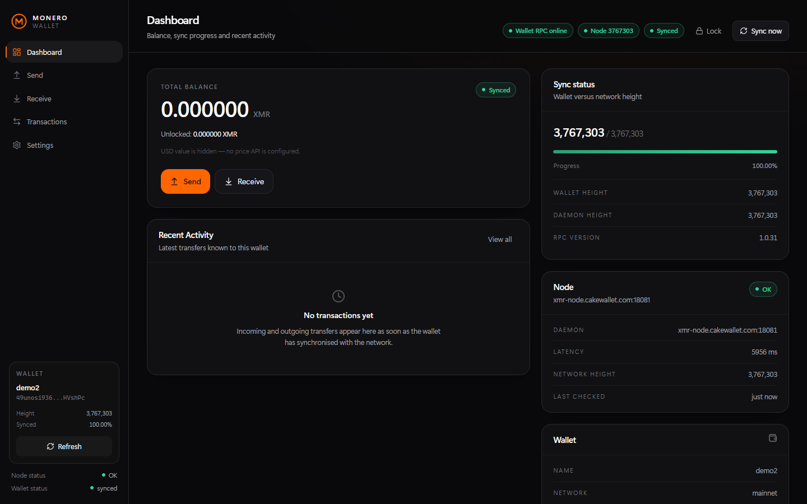
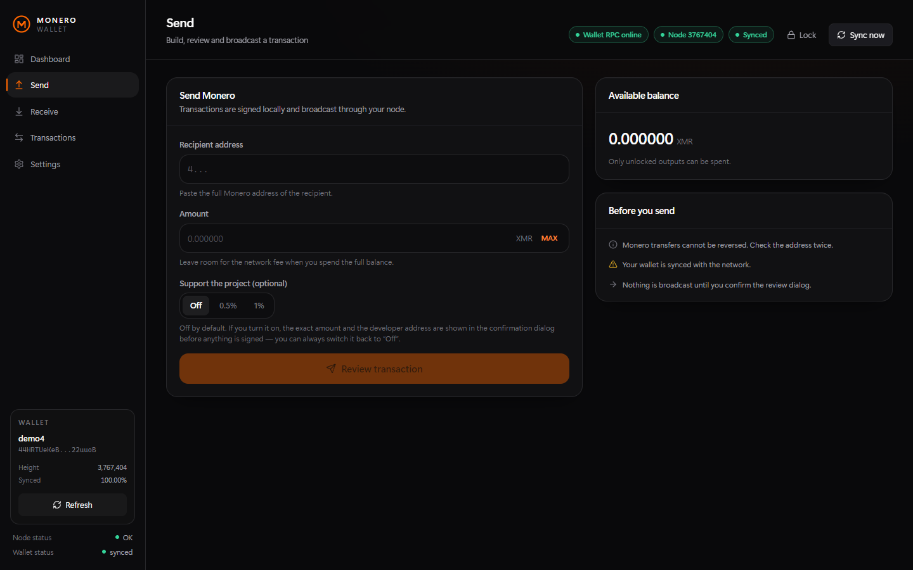
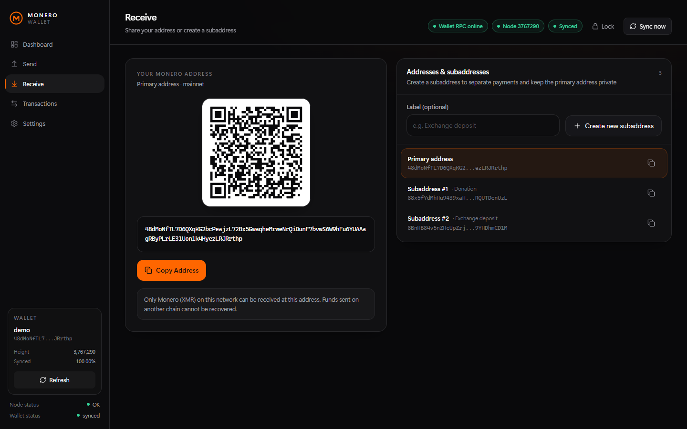
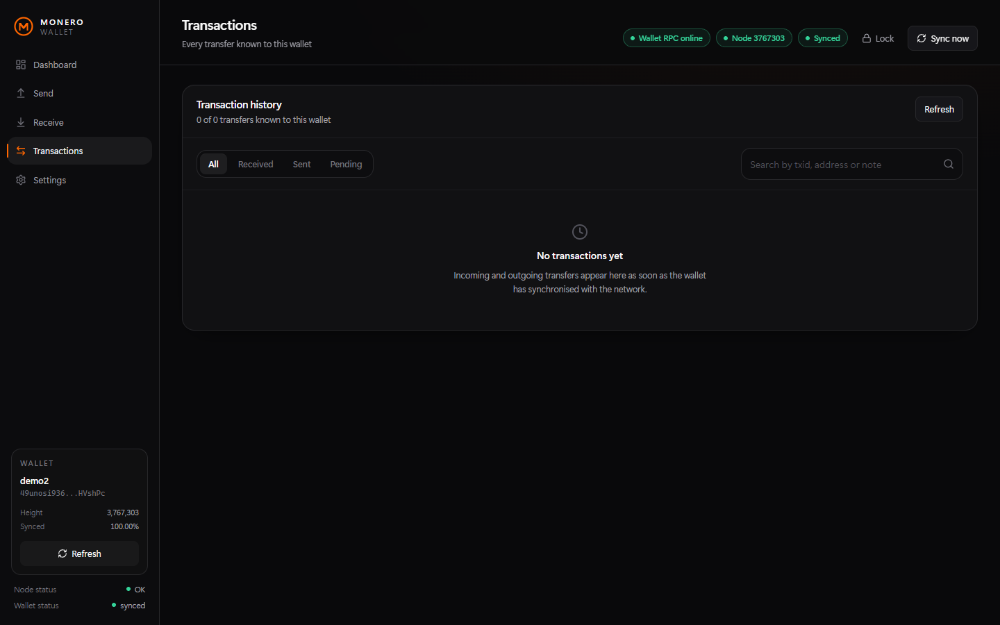
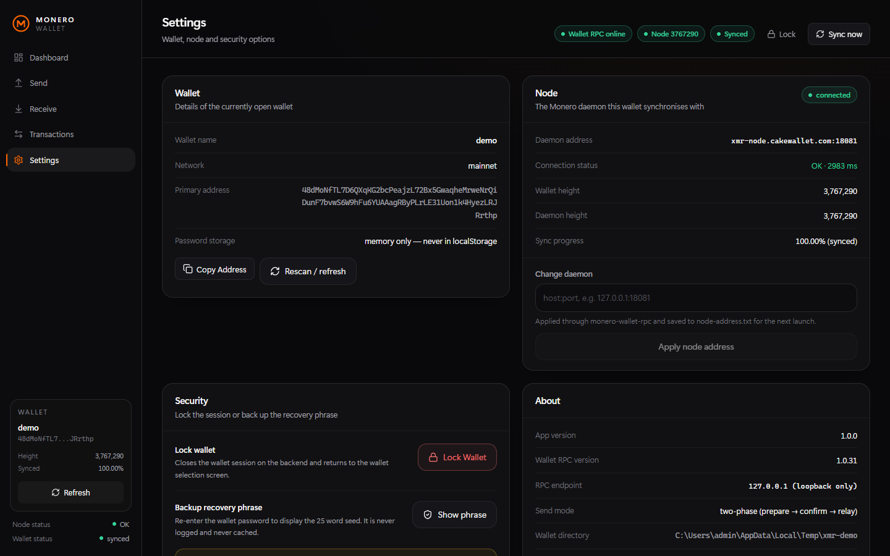
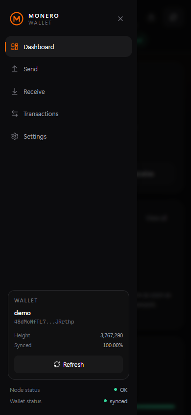

<div align="center">

# Monero Web Wallet

**Самостоятельно размещаемый (self-hosted) веб-кошелёк Monero с тёмным адаптивным интерфейсом на базе официального `monero-wallet-rpc`. Без сторонних серверов, без телеметрии и без демонстрационных данных.**

[English](README.md) · **Русский**

[](https://github.com/AMLChecker/monero-web-wallet/actions/workflows/build.yml)
[](LICENSE)
[](https://github.com/AMLChecker/monero-web-wallet)
[](https://nodejs.org)
[](https://www.getmonero.org/downloads/)

[Сайт проекта](https://amlchecker.github.io/monero-web-wallet/) · [Issues](https://github.com/AMLChecker/monero-web-wallet/issues) · [Releases](https://github.com/AMLChecker/monero-web-wallet/releases)

</div>

---

**Monero Web Wallet** — это локальный веб-кошелёк (GUI) для [Monero (XMR)](https://www.getmonero.org/), который
полностью работает на вашем компьютере. Интерфейс на React общается только с локальным backend'ом на `127.0.0.1`,
а все операции с кошельком — создание, балансы, построение и отправка транзакций — выполняет
**официальный бинарник `monero-wallet-rpc`**. Криптография Monero здесь не переписывалась: ключи не покидают вашу
машину, а интерфейс не показывает выдуманные балансы и «демо-транзакции».

```
Браузер (React UI)  →  backend 127.0.0.1:18082  →  monero-wallet-rpc 127.0.0.1:18083  →  monerod / ваш узел
      без ключей              без ключей в браузере          официальный бинарник          полная валидация
```

## Возможности

- **Работа с реальным кошельком** — создание нового кошелька (25 слов показываются один раз) и открытие любого
  существующего wallet-файла по паролю.
- **Баланс и синхронизация** — total / unlocked / locked, высота кошелька против высоты сети и прогресс-бар.
- **Полная история** — входящие, исходящие, pending и failed через `get_transfers`, с подтверждениями, состоянием
  блокировки, payment id и деталями транзакции.
- **Двухфазная отправка** — транзакция сначала строится и подписывается локально (`do_not_relay`), вы видите
  **точную комиссию**, и только после подтверждения она рассылается (`relay_tx`).
- **Субадреса** — создание с метками, переключение, копирование и QR-код для любого адреса.
- **Управление узлом** — статус демона, задержка, высота сети и переключение узла прямо в Settings.
- **Резервная копия seed** — экспорт 25 слов только после повторного ввода пароля кошелька.
- **Тёмный адаптивный интерфейс** — боковая панель на десктопе, выезжающее меню на телефоне, таблицы превращаются
  в карточки, модальные окна — в нижние шторки.

## Скриншоты

Все кадры сделаны на демо-кошельке без средств — реальных адресов, балансов и истории в репозитории нет.

| Dashboard | Send | Receive |
| --- | --- | --- |
|  |  |  |

| Transactions | Settings | Мобильный вид |
| --- | --- | --- |
|  |  |  |

## Требования

- **Windows 10/11** для запуска через `Start.bat` (backend и фронтенд кроссплатформенные — см. ручную установку).
- **Node.js 18+**.
- **Официальные бинарники Monero** рядом с `Start.bat`: `monero-wallet-rpc.exe`, `monero-wallet-cli.exe`,
  `monerod.exe` — скачать на <https://www.getmonero.org/downloads/>. В репозиторий они не входят.
- Доступный демон Monero: свой `monerod` (рекомендуется) или публичный узел.

## Быстрый старт (Windows)

```text
1. Положите monero-wallet-rpc.exe, monero-wallet-cli.exe и monerod.exe рядом с Start.bat
2. Запустите Start.bat
3. Браузер откроет http://127.0.0.1:18082/#/welcome
4. Нажмите «Open main» (или «Create New Wallet») и введите пароль кошелька
```

Что делает лаунчер: проверяет бинарники и Node.js, при необходимости ставит npm-зависимости и собирает проект,
поднимает `monero-wallet-rpc` на `127.0.0.1:18083` со **случайным RPC-логином на каждый запуск**, запускает backend
на `127.0.0.1:18082` (он же отдаёт собранный интерфейс) и открывает кошелёк в браузере.

```bat
Start.bat              запуск (сборка при необходимости)
Start.bat --rebuild     принудительная пересборка
Start.bat --dev         Vite dev-сервер на 127.0.0.1:5173
Stop.bat                остановить все сервисы
```

## Ручная установка (любая ОС)

```bash
# 1. официальный wallet RPC
monero-wallet-rpc --wallet-dir . --rpc-bind-ip 127.0.0.1 --rpc-bind-port 18083 \
  --rpc-login user:pass --daemon-address 127.0.0.1:18081 --non-interactive

# 2. backend
cd backend && npm install && npm run build
MONERO_RPC_LOGIN=user:pass npm start        # Windows: set MONERO_RPC_LOGIN=user:pass

# 3. фронтенд
cd ../frontend && npm install
npm run dev                                 # http://127.0.0.1:5173
npm run build                               # прод-сборка в frontend/dist
```

Если `frontend/dist` существует, backend отдаёт его сам, поэтому «прод» — это просто сборка обоих пакетов и
`node backend/dist/server.js`.

## Конфигурация

Все переменные окружения необязательны.

| Переменная | По умолчанию | Назначение |
| --- | --- | --- |
| `MONERO_RPC_URL` | `http://127.0.0.1:18083/json_rpc` | адрес wallet RPC |
| `MONERO_RPC_LOGIN` | значение из `.rpc-credentials` | `user:password` для digest-авторизации |
| `MONERO_WALLET_DIR` | корень проекта (или `wallets/`, если там уже есть кошельки) | каталог `--wallet-dir` |
| `MONERO_DAEMON_ADDRESS` | `127.0.0.1:18081`, затем `node-address.txt` | демон Monero (`host:port`) |
| `MONERO_SEND_MODE` | `prepare` | `prepare` — построить → подтвердить → relay; `direct` — один подтверждённый `transfer` |
| `PORT` / `HOST` | `18082` / `127.0.0.1` | адрес backend'а (держите loopback) |
| `LOG_LEVEL` | `info` | `debug`, `info`, `warn`, `error` |

Порты: интерфейс и API — `127.0.0.1:18082`, wallet RPC — `127.0.0.1:18083`, Vite (`--dev`) — `127.0.0.1:5173`.

## Кошельки и узлы

Кошелёк Monero — это всегда пара файлов `<имя>` и `<имя>.keys`; проект их никогда не перемещает и не удаляет.
Каталог кошельков определяется так: `MONERO_WALLET_DIR` → `wallets/` (если там уже есть `*.keys`) → корень проекта.

Адрес узла: `MONERO_DAEMON_ADDRESS` → локальный `monerod` на `127.0.0.1:18081` → `node-address.txt` → узел из
`FALLBACK_NODE` в `Start.bat`. Свой узел настоятельно рекомендуется: публичный узел видит ваш IP и то, какие блоки
запрашивает кошелёк. Сменить узел можно в Settings, значение сохраняется в `node-address.txt`.

## Как работает отправка

1. **Review** — backend строит транзакцию локально (`do_not_relay: true`) и возвращает точную комиссию, сумму и итог;
   подписанный блоб остаётся на backend'е и в браузер не попадает.
2. **Confirm & Send** — только после этого вызова выполняется `relay_tx`, и транзакция уходит в сеть; txid сразу
   виден и попадает в историю как pending до подтверждения майнерами.

Отмена в диалоге удаляет подготовленную транзакцию — без второго клика ничего не рассылается. Если ваша сборка
wallet RPC не отдаёт `tx_metadata`, выставьте `MONERO_SEND_MODE=direct`.

## Безопасность

- `monero-wallet-rpc` слушает только `127.0.0.1`, digest-авторизация включена, `--disable-rpc-login` не используется.
- Логин/пароль RPC генерируются заново при каждом запуске и живут только на backend'е (`.rpc-credentials`, в `.gitignore`).
- Пароль кошелька не сохраняется ни на диск, ни в `localStorage`, ни в логи; seed показывается только при создании
  кошелька или явном экспорте с повторной проверкой пароля.
- Суммы считаются в atomic units (`BigInt`), числа с плавающей точкой для денег не используются.
- Backend отклоняет запросы с не-loopback `Host`/`Origin` (защита от DNS-rebinding и сторонних сайтов).
- Ни одна транзакция не уходит без явного подтверждения.

Подробности — в [SECURITY.md](SECURITY.md) и [docs/ARCHITECTURE.md](docs/ARCHITECTURE.md).

## Если что-то не работает

| Симптом | Причина и решение |
| --- | --- |
| «Wallet RPC Offline» | не запущен `monero-wallet-rpc.exe` или занят порт 18083. Запустите `Stop.bat`, затем `Start.bat`; смотрите `logs\wallet-rpc.log`. |
| «This wallet is already open in another Monero program» | тот же wallet-файл открыт в `monero-wallet-cli.exe` — закройте его. |
| «Daemon unavailable» | узел недоступен: запустите `monerod` или смените узел в Settings. |
| «monero-wallet-rpc cannot see this wallet file» | RPC запущен с другим `--wallet-dir`, чем ожидает backend. |
| Порт 18082/18083 занят | работает старая копия — `Stop.bat` или диспетчер задач. |
| Полный список | [таблица troubleshooting](README.md#troubleshooting) в английском README |

Нашли проблему — [откройте issue](https://github.com/AMLChecker/monero-web-wallet/issues/new?template=bug_report.yml)
(для проблем с запуском есть [отдельная форма](https://github.com/AMLChecker/monero-web-wallet/issues/new?template=setup_help.yml)).
Никогда не прикладывайте пароль, seed и приватные ключи.

## Лицензия

[MIT](LICENSE). Бинарники Monero распространяются Monero Project по своей лицензии и в этот репозиторий не входят.

Проект не связан с Monero Project и не поддерживается им. ПО не проходило аудит: начинайте с малых сумм и всегда
держите офлайн-копию seed-фразы.

## Поддержать проект

Разработка ведётся в свободное время, без рекламы и платных тарифов. Если кошелёк оказался полезен — можно
поддержать дальнейшую разработку донатом в Monero (по желанию и без возврата).

<div align="center">


```text
4ApMgwswd6rUeSu3K9bVoyV5hmjcVLuDUePgk4r8bqh85oQYjF3LVTnAiMfp4ukrAL4umhrV6DfaRP5nXbdLZ3CbMTzmico
```

</div>

Отправляйте только XMR в сети mainnet: средства, отправленные в другой сети или другим активом, восстановить нельзя.
